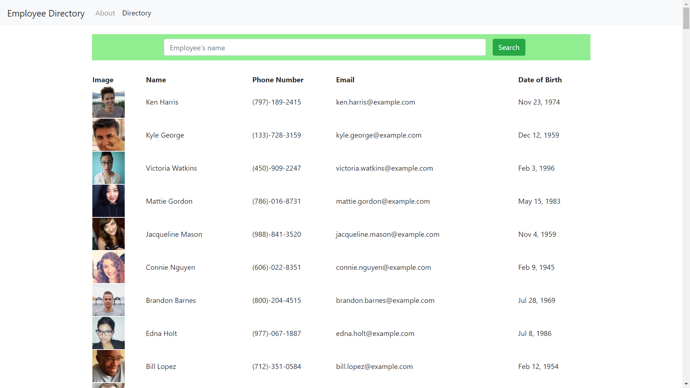

        

# Employee Directory
A react app allowing employees to view a directory of all their coworkers.

#### [Deployed App](https://pure-journey-91812.herokuapp.com/)

## Concept
As a user, I want to be able to view my entire employee directory at once so that I have quick access to their information.

## Installation and Usage
1. Install the required modules by typing "npm install" or "npm i" using your code editor terminal; must be at the same level as the package.json.
2. This app's uses the [Random User Api ](https://randomuser.me/). 
    * If you would like to insert your own employee list: 
        1. Update the axios call in ./src/utils/API.js. 
        2. Then verify the props on ./src/ResultsTable/index.js, lines 23-27, call the correct info (ie. you may need person.firstName instead of person.name.first).
    * An additional option: While I was working on this app, the Random User website crashed for a bit. Random User is an open source project and has a [repo on GitHub](https://github.com/RandomAPI/Randomuser.me-Node). I downloaded the repo and hosted a version of the API on my localhost server port 4000. If you choose to do the same, change the axios call to "http://localhost:4000/api/?results=200&nat=us" . If needed, update the 4000 to the port running your local version of Random Users. 
3. Run the app by typing "npm start". A new window should open in your default browser. If it does not, fo to http://localhost:3000 .

## Tech Utilized
* React
* HTML
* CSS
* Javascript
* jQuery
* Bootstrap
* NPM
* Node

## Future Development
* Search as user types. Currently, the app searches only when user clicks the search button. Using state, the app could potentially filter users after every keystroke.
* Using components, this app could render a more detailed profile for each employee when someone clicks on their information. 
* A feature could be added that could start an email when the email address is clicked. 
* A feature could be added to call the phone number when clicked using a phone program like skype. 

## Credits
* [Random User Api ](https://randomuser.me/) provided all the random employees for this project.
* This project was one of my first React projects and I could not have completed it without the help of my Instructor, tutor, and TAs at the University of Oregon Coding Bootcamp.

## License

MIT License

Copyright (c) 2020 Laurie J Schroeder

Permission is hereby granted, free of charge, to any person obtaining a copy
of this software and associated documentation files (the "Software"), to deal
in the Software without restriction, including without limitation the rights
to use, copy, modify, merge, publish, distribute, sublicense, and/or sell
copies of the Software, and to permit persons to whom the Software is
furnished to do so, subject to the following conditions:

The above copyright notice and this permission notice shall be included in all
copies or substantial portions of the Software.

THE SOFTWARE IS PROVIDED "AS IS", WITHOUT WARRANTY OF ANY KIND, EXPRESS OR
IMPLIED, INCLUDING BUT NOT LIMITED TO THE WARRANTIES OF MERCHANTABILITY,
FITNESS FOR A PARTICULAR PURPOSE AND NONINFRINGEMENT. IN NO EVENT SHALL THE
AUTHORS OR COPYRIGHT HOLDERS BE LIABLE FOR ANY CLAIM, DAMAGES OR OTHER
LIABILITY, WHETHER IN AN ACTION OF CONTRACT, TORT OR OTHERWISE, ARISING FROM,
OUT OF OR IN CONNECTION WITH THE SOFTWARE OR THE USE OR OTHER DEALINGS IN THE
SOFTWARE.
